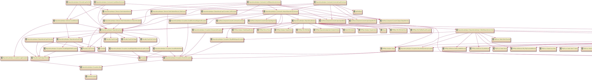

# DependencyAnalyzer

Analyze/Verify dependency map for php.

[](https://packagist.org/packages/nazonohito51/dependency-analyzer)
[](https://scrutinizer-ci.com/g/nazonohito51/dependency-analyzer/build-status/master)
[](https://scrutinizer-ci.com/g/nazonohito51/dependency-analyzer/?branch=master)

## Description

Dependency analyzer help you to keep cleaning your architecture.

If you start to managing dependencies between classes likely [Clean Architecture](http://blog.cleancoder.com/uncle-bob/2012/08/13/the-clean-architecture.html) or Layered Architecture, you will aware inspecting dependency between classes by eye is very difficult in PHP.
This library analyze dependencies in your repository, and take some way of using it to you.(Example: Create UML graph, Verify by your rule, Detect cycle path)

## Basic Usages
### Create dependency graph



```bash
vendor/bin/analyze-deps graph ./you/want/to/analyze/dir --output ./graph.puml
```

Analysis dependency map and create graph. Now, dependency analyzer support only [Plant UML](https://github.com/plantuml/plantuml) format.

Maybe, your graph will have many classes, and is very complex! If you need to simplify your graph, see [Advanced Usage](#Advanced Usages). 

### Verify your dependency rule
In Clean Architecture, there is dependency rules between classes.
You can define your dependency rule, and this library will detect rule violation in your repository and notify them to you.

First, you can define your rule by php file, like below:

```php
<?php
// ./your_rule_file.php

return [
    'layer dependency rule' => [                // name of your rule
        'domain_layer' => [                     // component name
            'define' => ['\Acme\Domain'],       // component definition by namespace
            'depender' => ['application_layer'] // rule of component dependency, for depender
        ],
        'application_layer' => [
            'define' => ['\Acme\Application'],
            'depender' => ['controller_layer']
        ],
        'controller_layer' => [
            'define' => ['\App', '!\App\Providers']
        ]
    ],
//    'some more rules' => [
//        'SomeComponent' => ['...'],
//        '...' => []
//    ]
];
```

`'component'` is a group of classes. (About class name matching rule, [see wiki](https://github.com/nazonohito51/dependency-analyzer/wiki/Class-name-matting).)
`'depender'` is classes/components that depend on component.
`'dependee'` is classes/components that is depended on component.
You can restrict depender/dependee.
Then, you can verify your repository like this:

```bash
php ./bin/analyze-deps verify --rule ./your_rule_file.php ./some/analyze/dir1  ./some/analyze/dir2
```

If there is rule violation, notify you of them.

```bash
layer dependency rule
+------------------------------------+-----------------+----+---------------------------+-------------+
| depender                           | component       |    | dependee                  | component   |
+------------------------------------+-----------------+----+---------------------------+-------------+
| App\UseCaseRequests\GetUserRequest | ControllerLayer | -> | Acme\Domain\Entities\User | DomainLayer |
+------------------------------------+-----------------+----+---------------------------+-------------+
```

And, you can use phpdoc too.
You can restrict depener of class by writing `@canOnlyUsedBy`.

```php
<?php
namespace Acme\Domain\ValueObjects;

/**
 * @canOnlyUsedBy \Acme\Domain\Entities\User
 * @canOnlyUsedBy \Acme\Application\Responses\GetUserResponse
 */
class UserName
{
    // ...
}
```

Then, you can verify your repository. (command is same as above)
Of course, you can use rule file and phpdoc at same time.
In the process of analyse, this library collect `@canOnlyUsedBy`, and verify your repository.
If there is rule violation, notify you of them.

```bash
phpdoc in Acme\Domain\ValueObjects\UserName
+------------------------------------------------+-----------+----+-----------------------------------+-----------+
| depender                                       | component |    | dependee                          | component |
+------------------------------------------------+-----------+----+-----------------------------------+-----------+
| Acme\Application\Repositories\UserRepository   | other     | -> | Acme\Domain\ValueObjects\UserName | phpdoc    |
| Acme\Application\Responses\CreateUserResponse  | other     | -> | Acme\Domain\ValueObjects\UserName | phpdoc    |
| Acme\Application\UseCases\CreateUserInteractor | other     | -> | Acme\Domain\ValueObjects\UserName | phpdoc    |
+------------------------------------------------+-----------+----+-----------------------------------+-----------+
```

### Detect cycle dependency

In [Acyclic dependencies principle](https://en.wikipedia.org/wiki/Acyclic_dependencies_principle), dependencies graph should have no cycles.
You can detect cycles like this:

```bash
php ./bin/analyze-deps detect-cycle ./some/analyze/dir
```

```bash
+---------------------------------------------+----+
| class                                       |    |
+---------------------------------------------+----+
| App\Http\Controllers\Api\UserController     | -> |
| Acme\Application\UseCases\GetUserInteractor | -> |
| Acme\Domain\Entities\User                   | -> |
| App\Http\Controllers\UserController         | -> |
| App\UseCaseRequests\GetUserRequest          | -> |
| App\Http\Controllers\Api\UserController     |    |
+---------------------------------------------+----+
```

## What is dependency?
Dependency is knowledge of interface that is had by class.
In classes collaboration, every classes always have knowledge of interface of other classes.
If a interface is changed, classes what have knowledge of that interface is must fixed.

Dependency is created by under php syntaxes below.

* Type hinting
* Return value type
* call public method
* fetch public property/constant
* extends/implements
* throw
* catch
* foreach
* array access
* others...

This library analyze those syntaxes by using [PHPStan](https://github.com/phpstan/phpstan), and crate dependency map.

## Advanced Usages
### Create dependency graph
TBD...

* rule file
* namespace
* group
* comment

### Verify your dependency rule
TBD...

* rule file
  * multiple rules
  * depender/dependee
* phpdoc
* namespace rule
* magic keyword

## TODO
- [ ] README
  - [ ] graph
  - [ ] wiki
- [ ] Analyze Facade
- [x] Response object & format
  - [x] use table format
- [ ] comment of Plant UML
- [ ] fix namespace pattern matting(adjust file pattern matting)
  - [ ] \Hoge\Fuga\*
  - [ ] only !\Hoge\Fuga
- [ ] Graph format(another puml)
- [ ] original rule logic
  - [ ] remove dependency to vertex, edge
